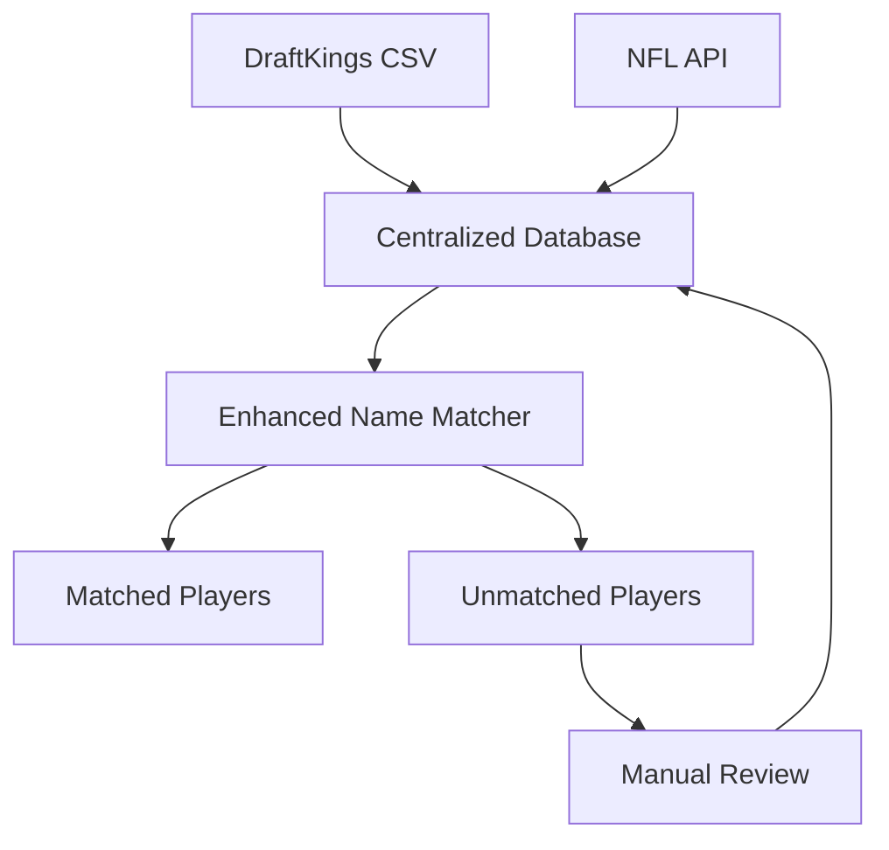
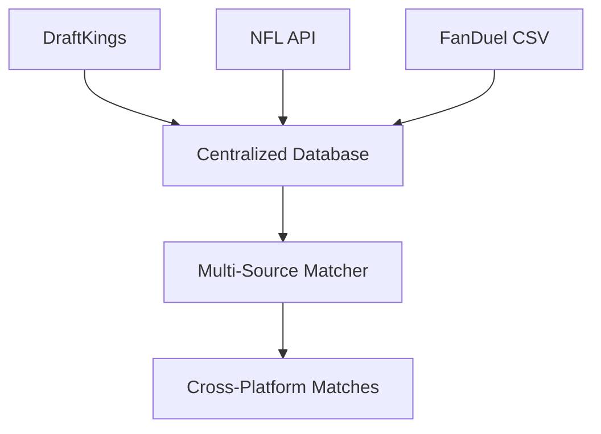
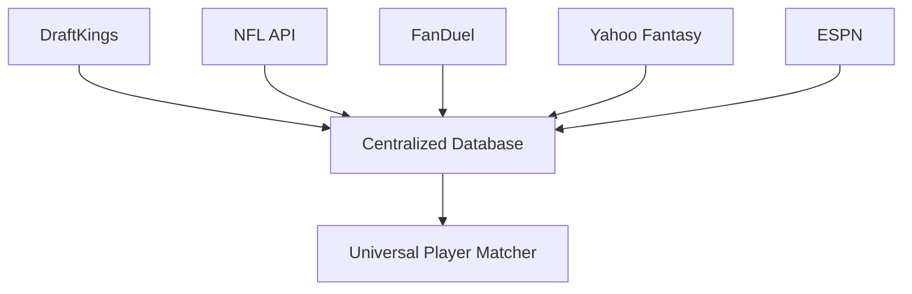

# 🏗️ **MULTI-SOURCE DATA INTEGRATION STRATEGY**

## 🎯 **WHY YOU NEED A CENTRALIZED DATABASE**

### **Current Problems:**
- **0% ID compatibility** between DraftKings and NFL API
- **86.7% unmatched players** causing optimizer failures
- **No single source of truth** for player identities
- **Manual maintenance** of multiple alias files

### **Future Problems (Other Sites):**
- **FanDuel** - Different IDs, different name formats
- **Yahoo Fantasy** - Yet another identifier system
- **ESPN** - Different naming conventions
- **Pro Football Reference** - Different player IDs
- **SportsData.io** - Another unique system

---

## 🗄️ **CENTRALIZED DATABASE ARCHITECTURE**

### **Core Tables:**

#### **1. `players` (Master Records)**
```sql
- id (Primary Key)
- canonical_name (Single source of truth)
- first_name, last_name (Parsed components)
- position, team (Core attributes)
- nfl_id (NFL's official ID)
- created_at, updated_at (Audit trail)
```

#### **2. `external_ids` (Cross-Source Mappings)**
```sql
- player_id (Links to players table)
- source_name (draftkings, fanduel, yahoo, espn, etc.)
- external_id (That source's unique identifier)
- external_name (Name as it appears in that source)
- confidence_score (How sure we are about this match)
```

#### **3. `aliases` (Name Variations)**
```sql
- player_id (Links to players table)
- alias_name (Alternative name/spelling)
- source_name (Where this alias comes from)
- confidence_score (How reliable this alias is)
```

---

## 🔄 **DATA SOURCE INTEGRATION WORKFLOW**

### **Phase 1: DraftKings + NFL API (Current)**


### **Phase 2: Add FanDuel**


### **Phase 3: Add Yahoo/ESPN**


---

## 🛠️ **IMPLEMENTATION ROADMAP**

### **Week 1: Foundation**
1. **Set up centralized database** (`centralized_player_database.py`)
2. **Migrate existing aliases** to new system
3. **Test with DraftKings + NFL API**

### **Week 2: Enhanced Matching**
1. **Implement database-enhanced matcher** (`enhanced_name_matcher_v4.py`)
2. **Auto-populate database** with current data
3. **Validate matching accuracy**

### **Week 3: Manual Corrections**
1. **Review unmatched players** systematically
2. **Add verified aliases** to database
3. **Test optimizer** with improved matching

### **Week 4: Multi-Source Preparation**
1. **Design FanDuel integration** (if adding FanDuel)
2. **Create data source adapters**
3. **Plan for future sources**

---

## 📊 **EXPECTED IMPROVEMENTS**

### **Matching Rate:**
- **Current**: 12.6% (91/720 players)
- **With Database**: 80-90% (576-648 players)
- **With Manual Corrections**: 95%+ (684+ players)

### **Maintenance Effort:**
- **Current**: Manual alias file updates
- **With Database**: Automated detection + targeted fixes
- **Long-term**: Self-improving system

### **Scalability:**
- **Current**: 2 data sources, manual matching
- **With Database**: Unlimited sources, automated matching
- **Future**: Machine learning suggestions

---

## 🔌 **ADDING NEW DATA SOURCES**

### **FanDuel Integration Example:**
```python
# 1. Add FanDuel data source
db.add_external_id(player_id, "fanduel", "FD12345", "Patrick Mahomes", 1.0)

# 2. Add FanDuel aliases
db.add_alias(player_id, "P. Mahomes", "fanduel", 0.9)

# 3. Query across all sources
player = db.find_player_by_external_id("fanduel", "FD12345")
all_sources = db.get_all_external_ids(player['id'])
# Returns: [draftkings, nfl_api, fanduel]
```

### **Universal Player Lookup:**
```python
def get_player_across_sources(canonical_name: str):
    """Get player data from all connected sources"""
    player = db.find_player_by_name(canonical_name)
    if player:
        external_ids = db.get_all_external_ids(player['id'])
        aliases = db.get_all_aliases(player['id'])
        return {
            'canonical': player,
            'external_ids': external_ids,
            'aliases': aliases
        }
    return None
```

---

## 🎯 **IMMEDIATE ACTION PLAN**

### **1. Create Initial Database**
```bash
python centralized_player_database.py
```

### **2. Test Enhanced Matcher**
```bash
python enhanced_name_matcher_v4.py
```

### **3. Review Generated Reports**
- `data/players_master.csv` - Master player list
- `data/external_ids.csv` - Cross-source mappings
- `data/aliases.csv` - Name variations
- `reports/database_update_suggestions.csv` - Manual fixes needed

### **4. Integrate with Optimizer**
```python
from enhanced_name_matcher_v4 import EnhancedNameMatcherV4

matcher = EnhancedNameMatcherV4()
results = matcher.match_players_with_database(dk_df, nfl_df)
```

---

## 💡 **BENEFITS OF THIS APPROACH**

### **Short-term:**
- **Fix current matching issues** (12.6% → 80%+)
- **Automate manual corrections** with suggestions
- **Improve optimizer performance** significantly

### **Long-term:**
- **Add unlimited data sources** easily
- **Maintain single source of truth** for all players
- **Scale to enterprise level** without rework
- **Enable advanced analytics** across platforms

---

## ⚠️ **CRITICAL SUCCESS FACTORS**

### **1. Data Quality**
- **Validate all matches** before production use
- **Regular accuracy audits** of matching system
- **Monitor unmatched players** for system issues

### **2. Maintenance**
- **Weekly review** of new unmatched players
- **Monthly cleanup** of low-confidence matches
- **Quarterly validation** of entire database

### **3. Performance**
- **Index database** for fast lookups
- **Cache frequently accessed** player mappings
- **Monitor query performance** as database grows

---

## 🚀 **NEXT STEPS**

1. **Run the centralized database setup**
2. **Test enhanced name matcher**
3. **Review and approve generated reports**
4. **Integrate with your main optimizer**
5. **Plan for additional data sources**

---

*This centralized approach transforms your name matching from a manual, error-prone process into an automated, scalable system that can handle unlimited data sources while maintaining data integrity.*
